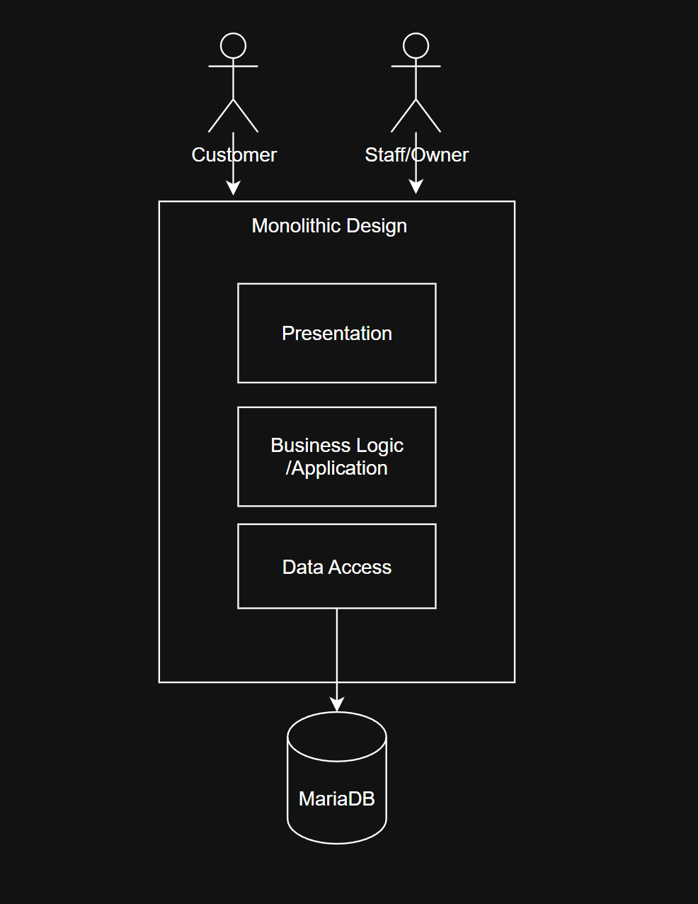
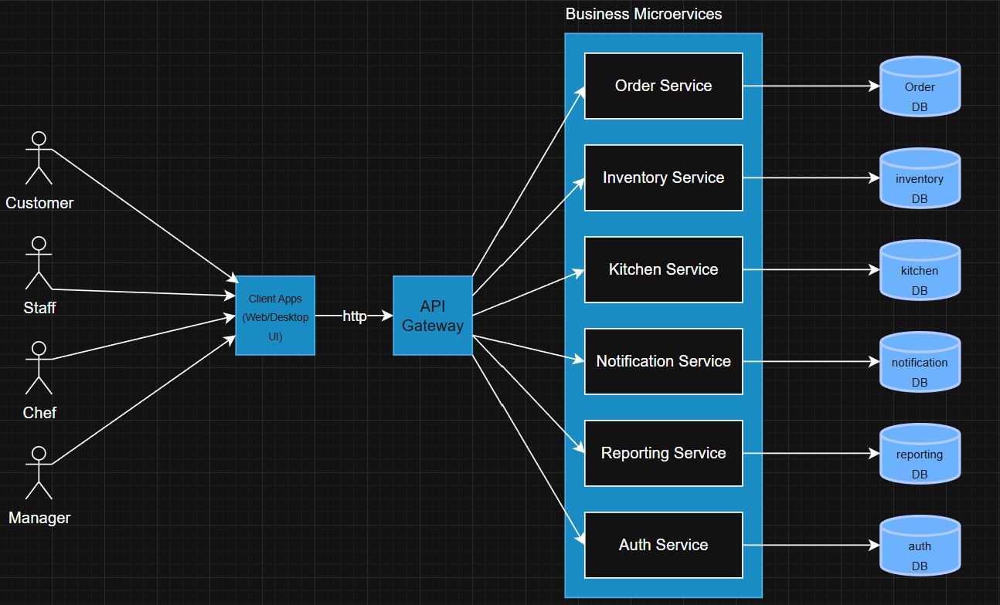
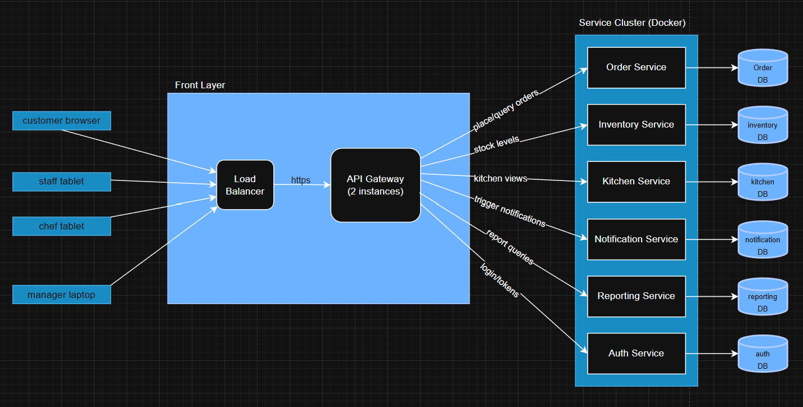
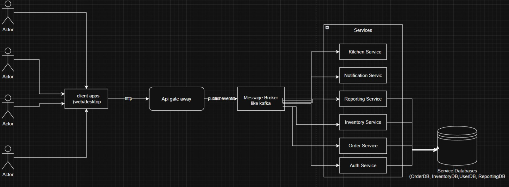
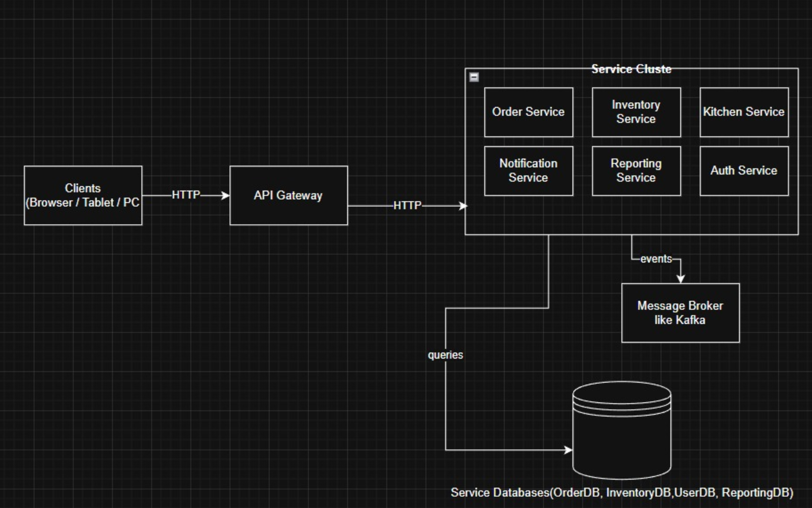

# Software Design Techniques - Keki

## Monolithic Architecture

A monolithic architecture design puts all of the application's components in one single unit.

If we were to use it for keki, it would be like this:

* Presentation/UI Layer - the user interface where:
    * Costumers browse cakes and place orders
    * Staff members/ owner manage orders

* Business Logic/ Application Layer - it handles:
    * Order management
    * Cake Customization
    * Inventory management
    * Notifications

* Data Access Layer - the interaction with database basically, it stores and lets us insert/update/delete the following data:
    * Orders
    * Recipes
    * Inventory stock
    * User data

* Database:
    * Mariadb

Everything runs as a single process.

**Figure 1: Monolithic Architecture**

### Pros
* Everything runs in one process
* Simple and easy to understand
* low complexity
* consistent
* Fast development and deployment

### Cons
* Limited scalability
* It is more difficult to make modifications
* Any small change required redeploying the whole application

## Microservices Architecture

### 2.1 Idea

In a microservices architecture we split the whole Keki system into several **small, independent services**, instead of having everything inside one big application.

Each microservice focuses on **one business capability** (orders, kitchen, inventory, auth, etc.) and runs in its own container.  
They all communicate through **simple HTTP APIs** (usually REST), and every microservice stores its own data in a dedicated database.

The client apps never talk directly to the services — they always go through an **API Gateway**, which is the single entry point to the backend.

### 2.2 Components & data flow

Main pieces:

- **Client apps** – customer, staff, chef, and manager interfaces.
- **Load Balancer** – distributes incoming traffic across multiple API Gateway instances.
- **API Gateway (x2)** – one entry point for all clients; routes requests to the right microservice.
- **Auth Service** – login, authentication, roles.
- **Order Service** – handles order creation, updates, and order data.
- **Inventory Service** – manages ingredients and stock checks.
- **Kitchen Service** – updates order preparation status (`PREPARING`, `BAKING`, `READY`).
- **Notification Service** – sends notifications.
- **Reporting Service** – analytics and statistics.
- Databases per service: `OrderDB`, `InventoryDB`, `UserDB`, `KitchenDB`, `ReportingDB`, etc.

Typical flow when a customer places an order:

1. Client → Load Balancer (`POST /orders`)
2. Load Balancer → API Gateway
3. API Gateway → Order Service
4. Order Service saves the order into **OrderDB**
5. API Gateway fetches any additional info needed
6. Client receives confirmation

### 2.3 Deployment

Typical deployment:

- **Client devices**: browser / tablet / mobile / laptop  
- **Front layer**:
  - Load balancer
  - 2× API Gateway instances  
- **Application Cluster** (Docker / Kubernetes):
  - Order Service
  - Inventory Service
  - Kitchen Service
  - Notification Service
  - Reporting Service
  - Auth Service  
- **Databases**:
  - One per microservice

### 2.4 Pros

- **Scalable** – services scale independently  
- **Fault isolation** – one service failing won’t take down the system  
- **Independent deployments** – update services individually  
- **Better maintainability** – smaller, focused codebases  
- **Technology flexibility** – each service can use different tech if needed  

### 2.5 Cons

- More infrastructure complexity  
- Harder debugging  
- More network hops = slightly more latency  
- Requires monitoring, logging, service discovery  
- Multiple databases to manage  

## 3. Event-Driven Distributed Architecture

### 3.1 Idea

Here we treat the whole system as a bunch of services reacting to **events**.  
Examples of events: `OrderPlaced`, `OrderConfirmed`, `CakeReady`, `StockLow`.

Each service **publishes** events when something happens and **subscribes** to the ones it cares about.  
All of this goes through a **message broker** (Kafka / RabbitMQ style), so services don’t need to call each other directly all the time.

### 3.2 Components & data flow

Main pieces:

- **Client apps** – customer / staff / chef / manager UIs.
- **API Gateway** – single entry point for all clients.
- **Auth Service** – login + roles.
- **Order Service** – stores orders, changes status, raises order events.
- **Inventory Service** – updates ingredient stock when orders are confirmed.
- **Kitchen Service** – reacts to confirmed orders, moves them to `BAKING` / `READY`.
- **Notification Service** – sends emails / app notifications based on events.
- **Reporting Service** – listens to business events and builds stats.
- **Message Broker** – event hub in the middle.
- Small databases per service: `OrderDB`, `InventoryDB`, `UserDB`, `ReportingDB`.

Typical flow when a customer places an order:

1. UI → API Gateway (`POST /orders`).
2. Gateway publishes `OrderPlaced`.
3. Order Service handles it, saves the order, publishes `OrderConfirmed`.
4. Inventory Service reacts, updates stock, maybe sends `StockLow`.
5. Kitchen Service reacts, updates status (`BAKING`, `READY`) via `OrderStatusChanged`.
6. Notification Service picks up those events and notifies the user.
7. Reporting Service logs everything for analytics.

**Component diagram here:**

### 3.3 Deployment

Rough deployment setup:

- Clients: browser / tablet / laptop.
- **Front layer**: load balancer + 2× API Gateway.
- **App cluster** (Docker / K8s):
  - Order, Inventory, Kitchen, Notification, Reporting, Auth services (each as pods).
- **Message broker cluster**.
- Databases for orders, inventory, users and reporting.

**Deployment diagram here:**

### 3.4 Pros

- **Loose coupling** - services mostly depend on events, not each other’s REST APIs.
- **Fits our domain** – orders move through states, inventory changes, notifications go out.
- **Real-time friendly** – easy to push live status updates.
- **Easy to extend** – we can plug in new services (e.g. loyalty points) just by subscribing to events.

### 3.5 Cons

- More things to run and monitor (broker + several services).
- Data is **eventually consistent**: small delays between services seeing the same change.
- Debugging can be harder because one scenario may involve several services and events.

## Conclusions

## 3.6 Conclusions

### Monolithic architecture

- Simple, all-in-one app, easy to start with  
- Harder to change and scale when the system grows  
- Any small change means redeploying the whole application  

### Microservices architecture

- System is split by features (orders, inventory, kitchen, etc.)  
- Each service can scale, deploy and fail independently  
- Smaller, more focused codebases  
- Requires more infrastructure (API Gateway, multiple services, etc.)  

### Event-driven distributed architecture

- Matches the idea of orders and stock as events (`OrderPlaced`, `StockLow`, etc.)  
- Easy to plug in new services by subscribing to events  
- More complex: message broker, eventual consistency, harder debugging  
- Probably too much for the current stage of the project  

### Final choice

Based on what was discussed above, we choose **microservices architecture** for Keki.

It gives a good balance: it is more scalable and maintainable than the monolithic approach, but not as complex to operate as a fully event-driven system. Later on, we can still add event-based communication on top of the microservices if needed.
